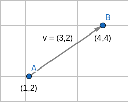
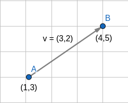

# Introdução à geometria computacional

Nesse artigo você vai aprender alguns conceitos básicos mas muito importantes para resolver problemas de geometria 2D.

# Pontos e vetores

Vamos começar por dois elementos básicos, pontos e vetores:
- Um ponto é composto por duas coordenadas no plano cartesiano, **x** e **y**.
- Um vetor pode ser representado por uma aresta direcionada entre dois pontos **p** e **q**. 

Para descobrir as dimensões de um vetor **v**, basta subtrair as coordenadas de seus pontos, pela seguinte fórmula: **v** = **(** **q**.x-**p**.x **,** **q**.y-**p**.y **)**;

Vetores são uma classe de equivalência, ou seja, apenas os identificamos por suas dimensões, não importa onde estejam no plano. Por exemplo:
- O vetor **v** entre os pontos **A**(1,2) e **B**(4,4) é (4-1,4-2) = **v**(3,2)
- O vetor **v** entre os pontos **A**(1,3) e **B**(4,5) é (4-1,5-3) = **v**(3,2)




Se somarmos um ponto a um vetor, iremos **transladar** o ponto seguindo a trajetória do vetor. Por exemplo, se somarmos o ponto **A**(1,2) ao vetor **v**(3,2), teremos o ponto (1+3,2+2) = (4,4). Também podemos enxergar essa operação como fixar a base do vetor **v** no ponto **p**.

## Representação em código
A seguir vamos ver uma forma de representar pontos, vetores e suas primeiras operações em C++. Para isso vamos usar uma struct e um conceito chamado **sobrecarga de operadores**. Esse é um conceito que vocês vão aprender em programação orientada a objetos, mas que vamos adiantar aqui por deixar o código mais simples de estruturar.

Por motivos de simplicidade, vamos representar tanto pontos como vetores pela struct **Point**, já que ambos são representados apenas por coordenadas (x,y). As definições de construtor e sobrecarga de operadores podem ser confusas de início, mas tentarei explicar ao máximo com comentários e exemplos na função main.

```cpp
struct Point{
    int x, y;

    // Este é o construtor da classe, que nada mais é do que uma maneira de instanciar uma variável do tipo Point já passando os valores de x e y.
    // Com isso podemos instanciar a variável assim: 
    // Point p = Point(1,2)

    Point(x, y){
        this->x = x;
        this->y = y;
    }

    // Quando declaramos um construtor customizado, o C++ nos obrigada a declarar um vazio
    Point() {}

    // Essa é a sobrecarga do operador "+". Estamos definindo que agora existe uma operação de soma para variáveis do tipo Point
    // Olhando para o código, estamos retornando um novo Point, que conterá a soma dos valores x,y com as coordenadas de outro ponto, o ponto b.
    // Os consts garantem que as variáveis usadas na operação não vão ser alteradas, e o compilador obriga a usar o mais externo
    Point operator+(const Point& b) const{
        // Aqui está uma vantagem de se definir um construtor, podemos passar os valores x,y direto na criação do Point resultante da operação de soma.
        return Point(x + b.x, y + b.y);
    }

    // Faremos o mesmo para a operação de subtração
    Point operator-(const Point& b) const{
        return Point(x - b.x, y - b.y);
    }
};

int main(void){
   
    /* Exemplo de operações usando construtor e sobrecarga de operadores*/

    // Criando pontos
    Point a(1,2);
    Point b(4,4);

    // v = b(4,4) - a(1,2) = (3,2)
    Point v = b-a;

   /* Exemplo das mesmas operações sem usar construtor e sobrecarga de operadores */
    Point a;
    a.x = 1, a.y = 2;
    
    Point b;
    b.x = 4, b.y = 4;

    Point v;
    v.x = b.x-a.x;
    b.y = b.y-a.y;

    // Pense que num problema, pode ser preciso fazer várias dessas operações com vários pontos e vetores. Usar essas técnicas pode poupar tempo e linhas de código, além de deixar o código mais claro na hora de debugar.
}
```