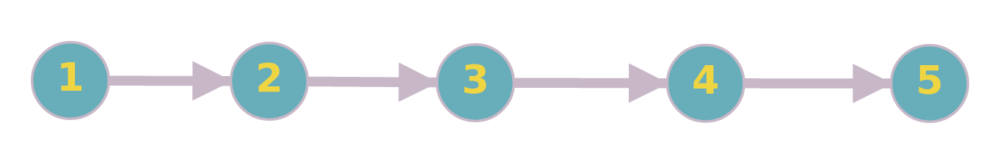

# Union Find

## Problema inicial

**Suponha o seguinte problema:**

Existem `n` computadores, enumerados de `1` a `n`, inicialmente totalmente desconectados. Serão realizadas `q` operações, que podem ser as seguintes:

- `1 x y`: conectar os computadores `x` e `y` com um fio

- `2 x y`: verificar se os computadores `x` e `y` estão conectados (direta ou indiretamente)

Restrições:

* `1 <= n <= 10^5`

* `1 <= q <= 10^5`

Exemplo de input:
```
4 5
1 1 2
1 2 3
2 1 2
2 1 3
2 1 4
```

Exemplo de output
```
yes
yes
no
```

**Solução:**

Podemos modelar este problema como um grafo. Os vértices são os computadores, e as arestas são os fios de ligação. Ou seja, "conectar dois computadores" seria criar uma aresta entre `x` e `y`, e a verificação de conexão entre os computadores pode ser realizada verificando se estes estão em uma mesma componente.

Uma das formas de se implementar isso é utilizando a estrutura de dados *union find* - também conhecida como *disjoint set union (DSU)*.

## A Estrutura

Iremos imaginar cada componente do grafo como sendo um conjunto. Como cada vértice aparece em somente uma componente conexa, os conjuntos são disjuntos.

Cada conjunto será representada por um *líder* (normalmente um número) (como se fosse a "raíz" do conjunto).

Por exemplo, no início do problema anterior, antes de serem realizadas as conexões, existem `n` conjuntos (um para cada computador), identificados por um número de `1` a `n`.

Porém, após serem realizadas conexões, este número líder pode ser alterado. Por exemplo, ao conectar os computadores `1` e `2`, eles passam a pertencer ao mesmo conjunto (que pode ser identificado por 1 ou por 2, dependendo da forma de implementação).

Com isso, é necessário que, dado um número `x`, a estrutura consiga achar o líder do conjunto que `x` está. Também é necessário que a estrutura consiga juntar dois conjuntos de maneira eficiente. Ou seja, serão necessárias duas funções principais:

- `Union / merge(u, v)`: une dois conjuntos: o que `u` está presente com o que `v` está presente;

- `Find(x)`: encontra o "líder" do conjunto em que `x` está presente

- `Same(u, v)`: verifica se `u` e `v` pertencem a uma mesma componente.

## Implementações

### Maneira ingênua

A primeira forma de se implementar este algoritmo é, de maneira ingênua, criar uma floresta, em que toda ligação entre dois componentes seja feita conectando os seus respectivos líderes.

```cpp
int par[N]; // par[x] armazena o pai do elemento x

void init() { // inicializa as variaveis
	for (int i = 0; i < N; i++) {
		par[i] = i;	// no inicio, cada conjunto é representado por ele mesmo (eu sou meu proprio lider)
	}
}

int find(int x) { // encontra o lider do conjunto em que x esta presente
	if (par[x] == x) return x; // nao existem mais lideres, este eh o representante do conjunto
	return find(par[x]); // vou procurar quem eh o lider do meu pai, este sera o lider geral
}

void merge(int u, int v) {
	int a = find(u), b = find(v); // encontra os lideres de cada conjunto
	par[a] = b; // conecta os lideres
}

bool same(int u, int v) {
	return find(u) == find(v); // se os lideres sao iguais, a componente e a mesma
}
```

Porém, é fácil observar que esta solução não é eficiente. Por exemplo, vejamos este caso (o input é está no mesmo modelo do problema anterior):

```
5 5
1 1 2
1 2 3
1 3 4
1 4 5
2 1 5
```



Neste caso, o problema está, por exemplo, ao procurar o representante do vértice 1. Para achá-lo, será necessário atravessar o grafo todo, com complexidade linear. Porém, existem métodos capazes de reduzir esta complexidade.

### Path Compression

Esta técnica utiliza a seguinte ideia: se eu sei o líder de um elemento em um instante, para que re-calcular? Basicamente, então, iremos memoizar o líder de x, comprimindo o caminho entre esses dois, com a mesma ideia de programação dinâmica.

```cpp
int find(int x) {
	if (par[x] == x) return x;
	return par[x] = find(par[x]); // apos encontrar o lider do conjunto todo, o pai é alterado
}
```

Esta alteração garante complexidade de O(log n) em média ([prova](https://www.cs.princeton.edu/courses/archive/spr09/cos423/Lectures/path-compression.pdf)).

### Union by Size

Aqui, faremos a seguinte mudança no código: em vez de sempre ligar o conjunto `a` no conjunto `b`, ligaremos o *menor deles* no *maior*. Desta forma, garante-se, por exemplo, que o pior caso (linear) não ocorrerá.

```c++
int par[N]; // pai do vertice i
int siz[N]; // tamanho do subconjunto de i

void init() {
	for (int i = 0; i < N; i++) {
		par[i] = i;
		siz[i] = 1; // como cada conjunto contem apenas ele mesmo, seu tamanho eh 1
	}
}

void merge(int u, int v) {
	int a = find(u), b = find(v); // encontra os lideres de cada conjunto
	if (a == b) return; // eles ja estao no mesmo conjunto

	if (siz[a] > siz[b]) swap(a, b); // "a" sera o menor conjunto entre "a" e "b"
	
	par[a] = b; // liga a em b
	siz[b] += siz[a]; // atualiza o tamanho do b (afinal, houve um append do conjunto 'a' nele)
}
```

Com esta técnica, também garante-se que a complexidade será O(log n).

### Union by Rank

A ideia é a mesma do `union by size`, porém, agora, utilizaremos um `rank` em vez do tamanho. Por exemplo, suponhamos que o rank utilizado é a profundidade da árvore do subconjunto (e não o seu tamanho).

```c++
int par[N]; // pai do vertice i
int rnk[N]; // rank do conjunto liderado por i

void init() {
	for (int i = 0; i < N; i++) {
		par[i] = i;
		rnk[i] = 0; // como cada conjunto contem apenas ele mesmo, sua profundidade eh 0
	}
}

void merge(int u, int v) {
	int a = find(u), b = find(v); // encontra os lideres de cada conjunto
	if (a == b) return; // eles ja estao no mesmo conjunto

	if (rnk[a] > rnk[b]) swap(a, b); // "a" sera o menor conjunto entre "a" e "b"

	par[a] = b;
	rnk[b] += rnk[a] == rnk[b]; // a nova profundidade sera alterada apenas quando os dois conjuntos ja tem a mesma profundidade (senao, a maior profundidade continuara servindo)
}
```

Com esta técnica, também garante-se que a complexidade será O(log n).

### Linking by index

Falaremos agora sobre algumas técnicas de *aleatorização*. A primeira dela é a *linking by index*, que, similarmente as técnicas anteriores, ligará o conjunto de menor índice no de maior índice. Porém, este índice não representa nada sobre a estrutura real da árvore, mas sim um valor aleatório.

```c++
int par[N]; // pai do vertice i
int idx[N]; // índice do conjunto liderado por i

void init() {
	for (int i = 0; i < N; i++) {
		par[i] = i;
		idx[i] = rand(); // valor aleatorio
	}
}

void merge(int u, int v) {
	int a = find(u), b = find(v); // encontra os lideres de cada conjunto
	if (a == b) return; // eles ja estao no mesmo conjunto

	if (idx[a] > idx[b]) swap(a, b); // "a" sera o menor conjunto entre "a" e "b"
	par[a] = b;
}
```

Sua complexidade, teoricamente, é a mesma do *union by size* - embora, praticamente, seja um pouco mais lenta.

###  Coin-flip linking

Esta técnica também se basea na escolha randômica. Porém, em vez de pré-definirmos um valor aleatório, faremos, em cada operação de merge, uma escolha aleatória.

```c++
void merge(int u, int v) {
	int a = find(u), b = find(v); // encontra os lideres de cada conjunto
	if (a == b) return; // eles ja estao no mesmo conjunto

	if (rand()%2) swap(a, b); // escolha aleatória
	par[a] = b;
}
```

Sua complexidade pode ser observada juntamente com mais informações sobre estas técnicas [aqui](https://www.cis.upenn.edu/~sanjeev/papers/soda14_disjoint_set_union.pdf).

### Observações

Podemos juntar algumas técnicas, para conseguir complexidades melhores. Por exemplo, a técnica de *path compression*, combinada com o *union by size/rank*, garante complexidade praticamente constante.

Em geral, é bem mais vantajoso **não** utilizar formas aleatórias, mas sim outras combinações, como *path compression* com *union by size*.

## Rollback

Suponhamos a seguinte adição ao problema inicial:

- `1 x y`: conectar os computadores `x` e `y` com um fio

- `2 x y`: verificar se os computadores `x` e `y` estão conectados (direta ou indiretamente)

- **`3`: retirar a ultima ligação feita**

Isso também pode ser feito facilmente. Por exemplo, suponhamos a implementação com *union by size*. Vejamos as mudanças que são feitas em cada operação de merge:

```
par[a] = b;
siz[b] += siz[a];
```

Ou seja, em cada união, as únicas coisas alteradas são o pai de `a` e o tamanho de `b`. Portanto, para recuperar estes valores, basta armazená-los em algum lugar (por exemplo, em uma pilha):

```c++
int par[N];
int siz[N];
stack<pair<int, int> > old_par;
stack<pair<int, int> > old_siz;

void merge(int u, int v) {
	int a = find(u);
	int b = find(v);
	if (siz[a] > siz[b]) swap(a, b);
	old_par.push(make_pair(a, par[a]));
	old_siz.push(make_pair(b, siz[b]));

	par[a] = b;
	siz[b] += siz[a];
}

void rollback() { // desfaz a ultima operacao de merge feita
	if (old_par.size() == 0 or old_siz.size() == 0) return; // nao houve ligacao

	par[old_par.top().first] = old_par.top().second; // recupera o pai
	siz[old_par.top().first] = old_par.top().second; // recupera o tamanho
	old_par.pop(); // pop nas pilhas
	old_siz.pop();
}
```

Como o rollback consiste em adicionar e retirar valores em pilhas, a complexidade dele é constante O(1).

Uma importante observação é que não se pode utilizar *rollback* com a técnica de *path compression*, por exemplo - afinal, o líder em determinado momento pode ser alterado.

## Persistência Parcial

Pensemos em outra adição para o problema inicial:

- `1 x y`: conectar os computadores `x` e `y` com um fio

- `2 x y t`: verificar se os computadores `x` e `y` estão conectados (direta ou indiretamente) **no momento t**, em que `t` representa o índice de alguma query do tipo 1.

Por exemplo:

Input:
```
3 4
1 1 2
1 2 3
2 1 3 2
2 1 3 1
```

Saída esperada:
```
yes
no
```

Para isso, teremos que fazer a seguinte alteração no grafo: as arestas de ligação entre duas componentes agora serão *ponderadas*, e o *peso* de cada aresta é o índice da query em que foi feita a conexão. Então, ao invés de simplesmente procurar pelo líder do conjunto *x*, será procurado o líder do conjunto *x* em algum momento *t*.

```c++
int par[N];
int siz[N];
int tim[N];

int find(int x, int t) {
	if (par[x] == x) return x; // lider encontrado
	if (tim[x] > t) return x; // a ligacao de x para seu pai foi feita depois do momento t
	return find(par[x], t); // tenta procurar no pai
}

bool same(int u, int v, int t) { // verifica se dois vertices pertencem ao mesmo componente no momento t
	return find(u, t) == find(v, t);
}

void merge(int u, int v, int t) { 
	int a = find(u, t);
	int b = find(v, t);
	if (siz[a] > siz[b]) swap(a, b);

	par[a] = b;
	tim[a] = t; // atualiza o tempo em que foi feita a ligacao
	siz[b] += siz[a];
}
```

Repare que esta adição não altera a complexidade.

## Persistência Total

Pensemos em *outra* adição para o problema inicial:

- `1 x y t`: conectar os computadores `x` e `y` com um fio **na versão t**;

- `2 x y t`: verificar se os computadores `x` e `y` estão conectados (direta ou indiretamente) **na versão t**

em que `t` representa o índice de uma query qualquer, e quando t=0, os computadores estão totalmente desconectados.

Por exemplo:

```
3 5
1 1 2 0
2 1 2 0
2 1 2 1
1 1 3 0
2 1 3 4
```

Saída esperada:
```
no
yes
yes
```

Como a estrutura do union-find é baseada em array, podemos utilizar, por exemplo, uma *seg-tree persistente* para manter os valores de cada versão.

```c++
const int MAXN = 1e5 + 5;

struct Node {
	int L, R; // filhos left e right

	int par, siz; // parent e size, utilizados se forem folha
	int tim; // tempo de alteracao

	Node() { L = R = -1; } // filhos nulos inicialmente
} seg[12 * MAXN];

int n; // qtt de nos
int root[MAXN]; // quem eh a raiz no momento i
int available; // ultimo nó utilizado
int cur_time; // tempo atual

void build(int p, int i, int j) {
	if (i == j) { // folha
		seg[p].par = i; // inicializacao padrao
		seg[p].siz = 1; // rank aleatorio
		seg[p].tim = 0;
	} else {
		int m = (i + j) / 2;

		seg[p].L = ++available;
		build(seg[p].L, i, m);

		seg[p].R = ++available;
		build(seg[p].R, m+1, j);
	}
};

// inicializa a seg persistente
inline void init() {
	root[0] = ++available;
	build(root[0], 1, n);
}

Node query(int p, int i, int j, int x, int t) { // quem eh o filho de X no tempo T
												// procurando na seg do intervalo [i, j]
												// atualmente no no p

	if (i == j) { // chegou na folha
		if (seg[p].tim > t) return seg[p];
		if (seg[p].par == x) return seg[p];
		return query(root[t], 1, n, seg[p].par, t);
	}

	int m = (i + j) / 2;
	if (x <= m) return query(seg[p].L, i, m, x, t);
	else return query(seg[p].R, m+1, j, x, t);
}

inline Node find(int x, int t) { // quem eh o lider de x no tempo t
	return query(root[t], 1, n, x, t);
}

inline bool same(int u, int v, int t) {
	return find(u, t).par == find(v, t).par;
}

int update_par(int p, int i, int j, int u, int v, int t) { // par[u] = v

	if (i == j) { // chegou na folha
		// cria um novo no

		++available;
		seg[available].tim = t;
		seg[available].par = v;
		seg[available].siz = seg[p].siz;
		return available;
	} else {
		int m = (i + j) / 2;

		if (u <= m) { // esta na esquerda
			int cur_node = ++available;
			seg[cur_node].R = seg[p].R;
			seg[cur_node].L = update_par(seg[p].L, i, m, u, v, t);

			return cur_node;
		} else {
			int cur_node = ++available;
			seg[cur_node].L = seg[p].L;
			seg[cur_node].R = update_par(seg[p].R, m+1, j, u, v, t);

			return cur_node;
		}
	}
}

int update_siz(int p, int i, int j, int u, int s, int t) { // siz[u] += s;

	if (i == j) { // chegou na folha
		// cria um novo no

		++available;
		seg[available].tim = t;
		seg[available].siz = seg[p].siz + s; // aumenta o tamanho
		seg[available].par = seg[p].par;
		return available;
	} else {
		int m = (i + j) / 2;
		if (u <= m) { // esta na esquerda
			++available;

			int cur_node = available;
			seg[cur_node].R = seg[p].R;
			seg[cur_node].L = update_siz(seg[p].L, i, m, u, s, t);

			return cur_node;
		} else {
			++available;

			int cur_node = available;
			seg[cur_node].L = seg[p].L;
			seg[cur_node].R = update_siz(seg[p].R, m+1, j, u, s, t);

			return cur_node;
		}
	}
}

// liga dois nos de acordo com a conexao no momento t
inline void merge(int u, int v, int t) {
	Node a = find(u, t);
	Node b = find(v, t);

	int old_par = a.par;
	int new_par = b.par;
	int old_siz = b.par;
	int new_siz = a.siz;

	if (a.par == b.par)
		new_siz = 0; // nao precisa alterar o tamanho
	if (a.siz > b.siz) swap(a, b);

	root[cur_time] = update_par(root[t], 1, n, old_par, new_par, t);
	root[cur_time] = update_siz(root[cur_time], 1, n, old_siz, new_siz, t);
}

int main() {
	int q; cin >> n >> q;
	init();

	while(q--) {
		int op; cin >> op;
		int x, y, t; cin >> x >> y >> t;

		++cur_time; // atualiza o tempo atual
		root[cur_time] = root[cur_time-1]; // a raiz, por enquanto, eh a mesma da antiga

		if (op == 1) { // conectar os fios
			merge(x, y, t);
		} else if (op == 2) { // verificar
			cout << (same(x, y, t) ? "yes" : "no") << '\n';
		}
	}

	return 0;
}
```

# Referências

- [cp-algorithms](https://cp-algorithms.com/data_structures/disjoint_set_union.html)
